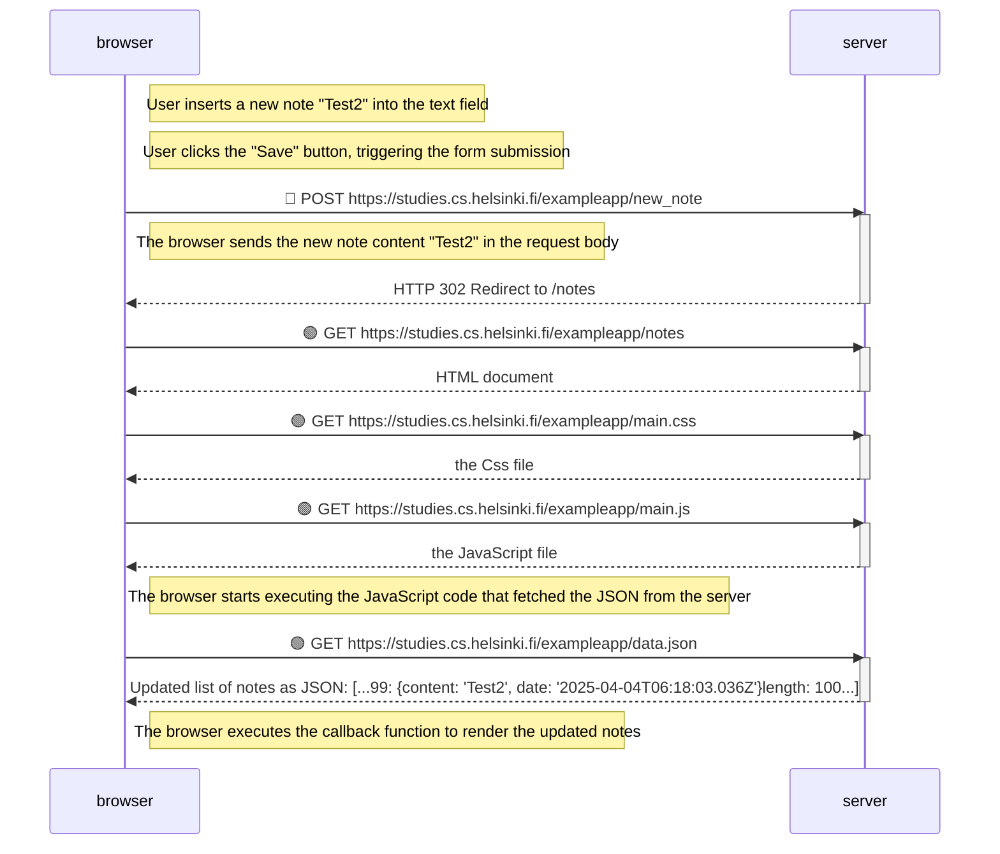

### Sequence diagram: Creating a new note "Test2"

```mermaid
sequenceDiagram
    participant browser
    participant server

    Note right of browser: User inserts a new note "Test2" into the text field
    Note right of browser: User clicks the "Save" button, triggering the form submission

    browser->>server: 🔴 POST https://studies.cs.helsinki.fi/exampleapp/new_note
    activate server
    Note right of browser: The browser sends the new note content "Test2" in the request body
    server-->>browser: HTTP 302 Redirect to /notes
    deactivate server

    browser->>server: 🟢 GET https://studies.cs.helsinki.fi/exampleapp/notes
    activate server
    server-->>browser: HTML document
    deactivate server

    browser->>server: 🟢 GET https://studies.cs.helsinki.fi/exampleapp/main.css
    activate server
    server-->>browser: the Css file
    deactivate server

    browser->>server: 🟢 GET https://studies.cs.helsinki.fi/exampleapp/main.js
    activate server
    server-->>browser: the JavaScript file
    deactivate server

    Note right of browser: The browser starts executing the JavaScript code that fetched the JSON from the server

    browser->>server: 🟢 GET https://studies.cs.helsinki.fi/exampleapp/data.json
    activate server
    server-->>browser: Updated list of notes as JSON: [...99: {content: 'Test2', date: '2025-04-04T06:18:03.036Z'}length: 100...]

    deactivate server

    Note right of browser: The browser executes the callback function to render the updated notes
```

